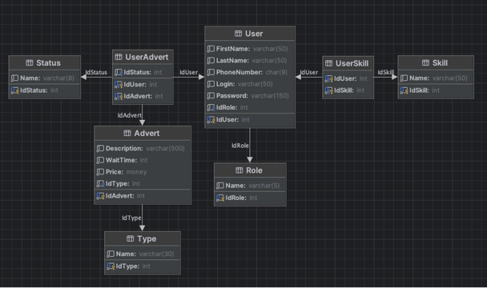

# Projekt TIN s28016 - Stanisław Stepka

## Opis projektu:
Aplikacja służąca do zamieszczania ogłoszeń dla inżynierów 
dźwięku i producentów muzycznych

## Schemat bazodanowy:

## Dostępne funkcjonalności:
### Dla gościa
- Wyświetlenie ogłoszeń bez paginacji
- Wyświetlenie ogłoszeń z paginacją z możliwością sortowania  
  (po czasie oczekiwania oraz cenie)
### Dla użytkownika zarejestrowanego
- Rejestracja
- Logowanie
- Wyświetlenie ogłoszeń bez paginacji
- Wyświetlenie ogłoszeń z paginacją z możliwością sortowania
- Dodanie ogłoszenia (maksymalnie 3 ogłoszenia, każde musi być innego typu)
- Edycja danych ogłoszenia
- Usunięcie ogłoszenia
- Edycja danych użytkownika  
  (hasło, numer telefonu – pozostałe dane nie są modyfikowalne, logika biznesowa)
### Dla administratora
- Wszystkie funkcjonalności ww.
- Wyświetlenie połączeń kluczowych tabel z możliwością usuwania rekordów połączonych zależnościami  
  (z wykluczeniem sytuacji dot. logiki biznesowej), możliwość sortowania oraz paginacja
    - Advert ⇔ Type ⇔ UserAdvert ⇔ Status ⇔ User
        - Usunięcie rekordu tego połączenia skutkuje usunięciem rekordu z tabeli Advert oraz UserAdvert

    - User ⇔ Role ⇔ UserSkill ⇔ Skill
        - Usunięcie rekordu tego połączenia skutkuje oprócz usunięcia rekordów z tabel User i UserSkill, usunięciem pozostałych powiązanych z użytkownikiem rekordów tj. rekordy w tabeli UserAdvert oraz Advert (logika biznesowa)
### Dodatkowo
- Możliwość rejestracji administratora  
  za pomocą końcówki zabezpieczonej za pomocą hasła znajdującego się w zmiennych środowiskowych (dotenv) serwera.